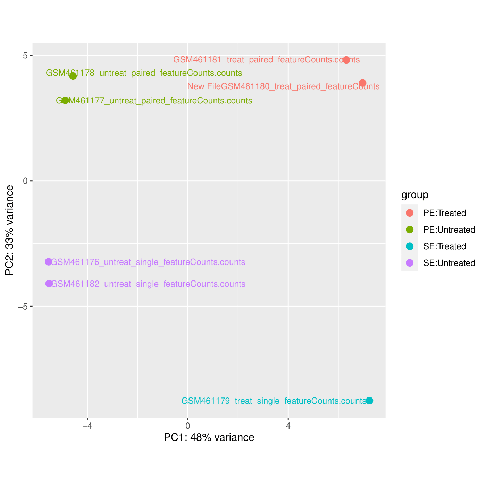
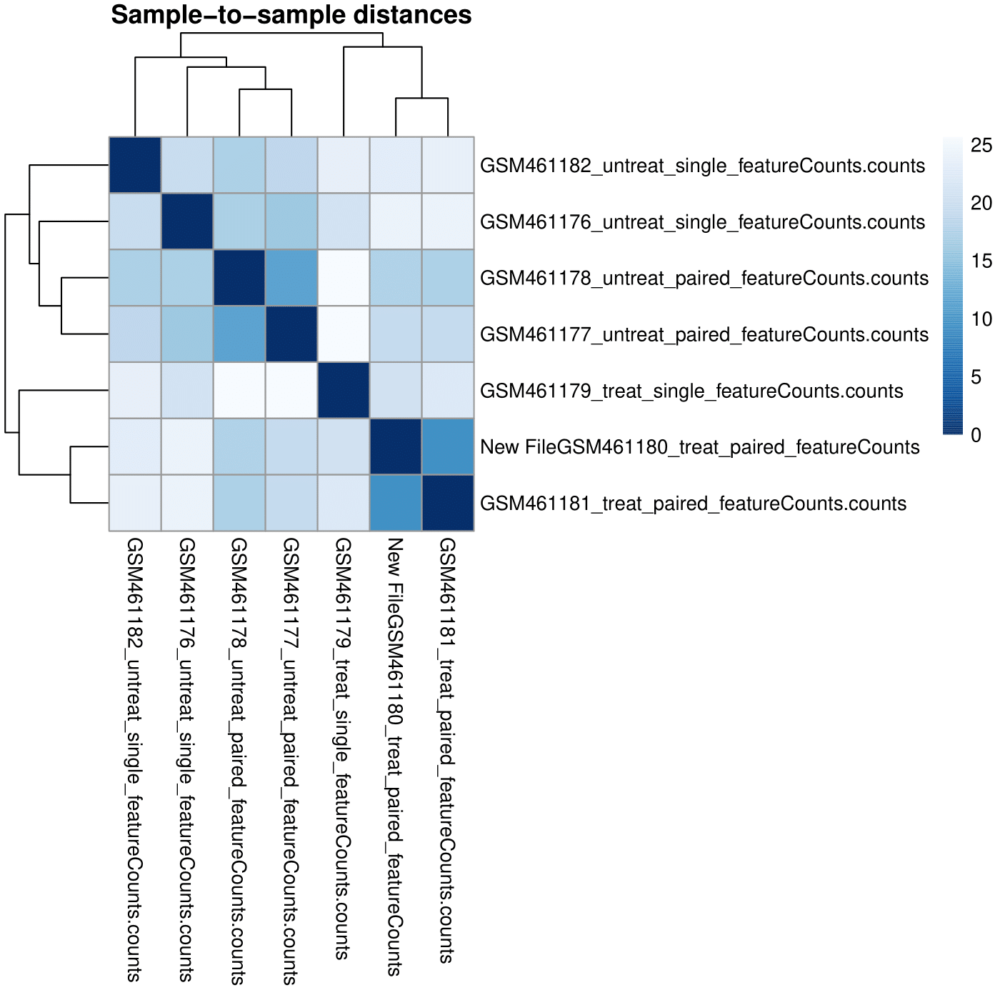
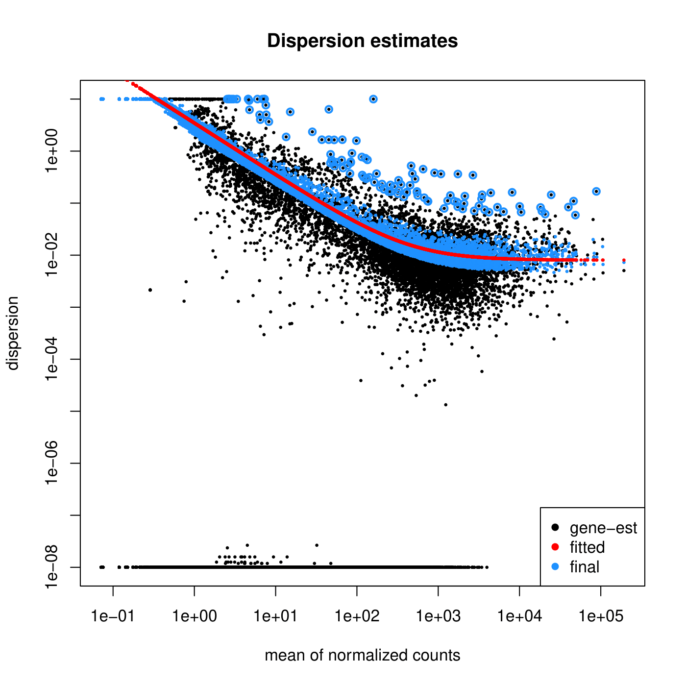
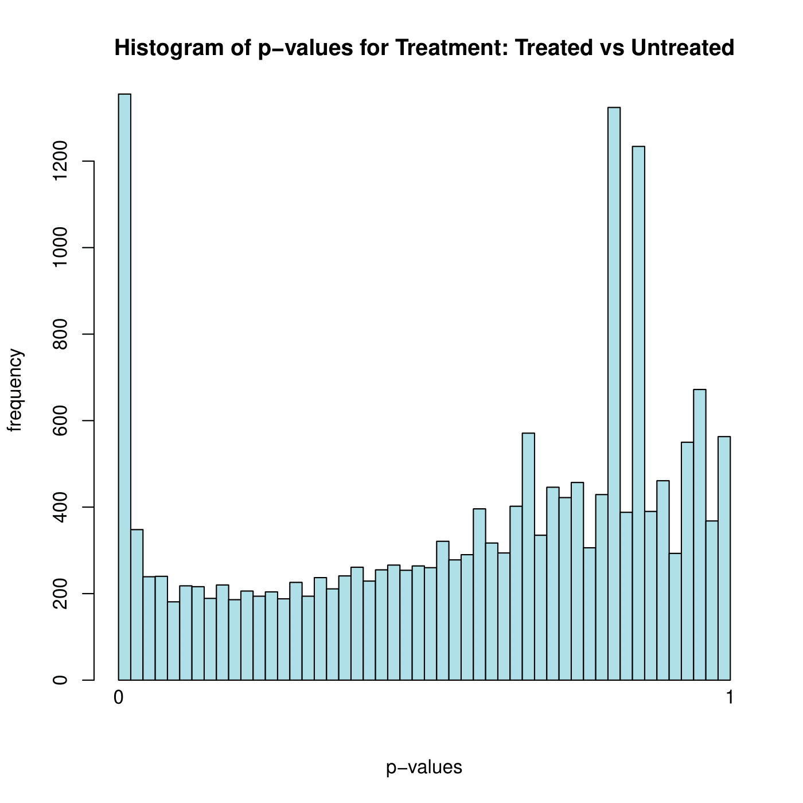
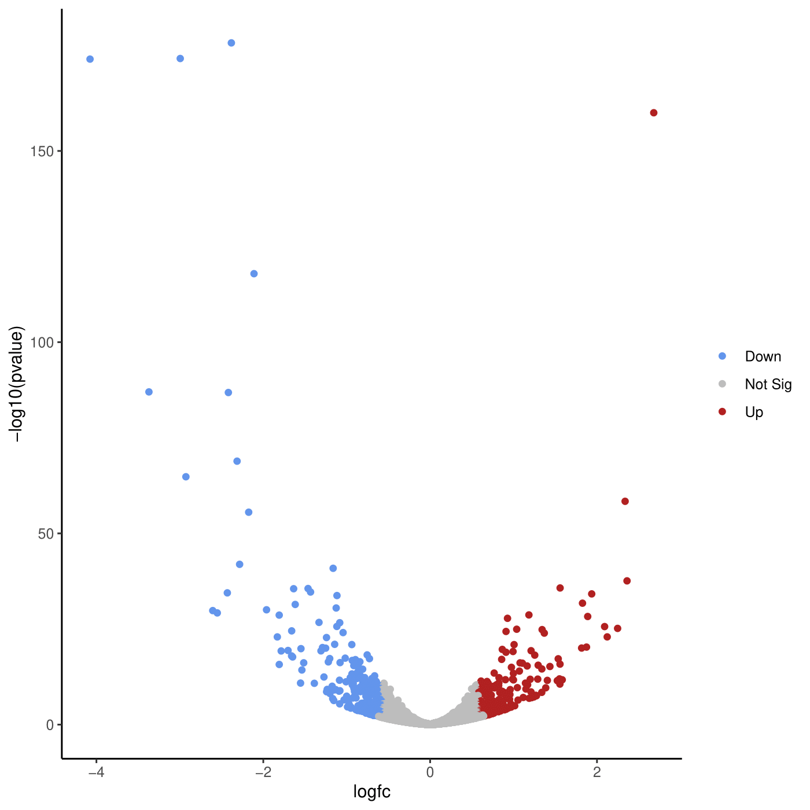
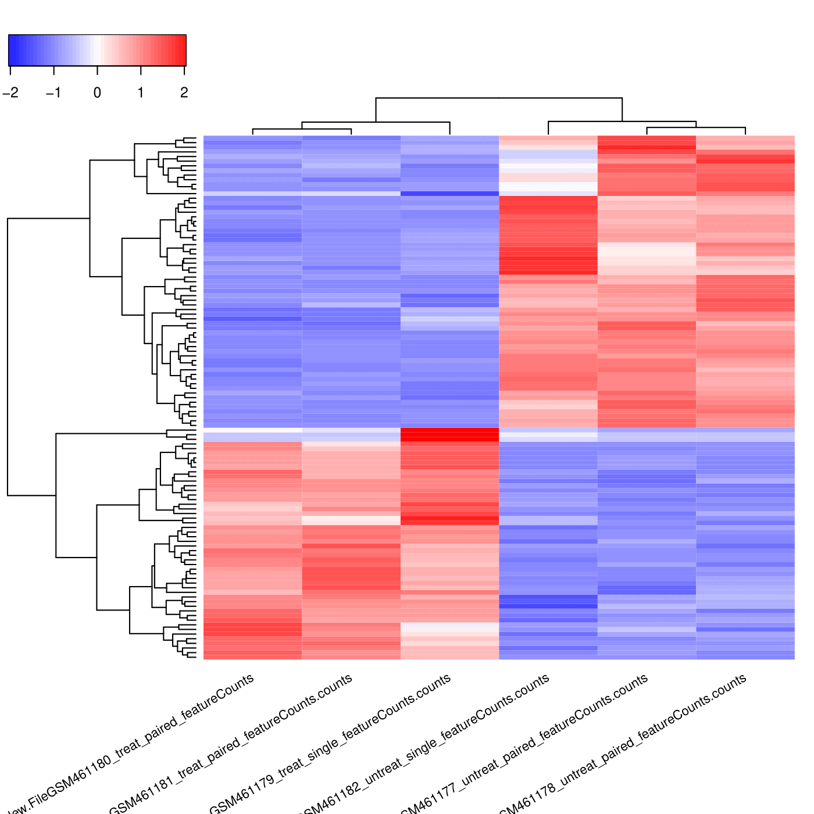

# RNA-Seq Analysis: Differential Gene Expression in Drosophila Pasilla Knockdown

Analysis of RNA-Seq data to identify differentially expressed genes in *Drosophila melanogaster* 
following RNAi-mediated depletion of the Pasilla (PS) gene, a splicing regulator homologous to 
mammalian NOVA proteins.

## Biological Context
- **Organism:** *Drosophila melanogaster* (fruit fly)
- **Gene of Interest:** Pasilla (PS) - splicing regulator
- **Experimental Design:** 
  - 3 untreated samples (control)
  - 3 PS-depleted samples (RNAi treatment)
  - Mix of paired-end and single-end sequencing

### Differential Expression Results
- **966 significantly differentially expressed genes** (adjusted p-value < 0.05)
- **113 genes with strong biological effect** (|log2FC| > 1, padj < 0.05)
  - 68 upregulated genes
  - 45 downregulated genes

### Top Biological Insights
1. **Pasilla gene successfully downregulated** (log2FC = -2.56, padj = 8.3×10⁻⁷)
2. **Most upregulated gene:** Ant2 (adenine nucleotide translocase 2) - log2FC = +2.68
3. **Enriched GO terms:** 
   - RNA splicing (expected - Pasilla is splicing regulator)
   - mRNA processing
   - Gene expression regulation
4. **Enriched KEGG pathways:**
   - Glycolysis/Gluconeogenesis (dme00010)
   - Metabolic pathways (dme01100)

   ----
   ### Analysis Pipeline
1. **Quality Control:** FastQC/Falco → MultiQC
2. **Read Trimming:** Cutadapt (Q20, min length 20bp)
3. **Alignment:** STAR aligner (2-pass, splice-aware mapping to dm6)
4. **Quantification:** featureCounts (gene-level counts)
5. **Differential Expression:** DESeq2 (multi-factor design controlling for sequencing type)
6. **Functional Enrichment:** goseq (GO terms, KEGG pathways)

### Statistical Approach
- **Normalization:** DESeq2 size factor normalization (accounts for library composition)
- **Multiple testing correction:** Benjamini-Hochberg FDR
- **Significance thresholds:** 
  - Adjusted p-value < 0.05
  - |log2 Fold Change| > 1 for biological relevance

### Tools Used
- **Platform:** Galaxy (version X.X)
- **Reference Genome:** *D. melanogaster* dm6 (Ensembl BDGP6.32.109)
- **Key Tools:** STAR, DESeq2, featureCounts, goseq, MultiQC

---

## Visualizations

### Principal Component Analysis

*Samples cluster by treatment (PC1) and sequencing type (PC2), confirming experimental design*

### Volcano Plot

*113 genes show significant differential expression with biological relevance (red/blue points)*

### Expression Heatmap

*Clear clustering of treated vs untreated samples based on expression of top DE genes, also highlithing Z-score differences*

## Data Sources

- **Original Study:** Brooks et al. (2011) - Conservation of splicing regulation
- **Data Repository:** NCBI GEO accession [GSE18508](https://www.ncbi.nlm.nih.gov/geo/query/acc.cgi?acc=GSE18508)
- **Reference Genome:** Ensembl dm6
- **Tutorial Source:** [Galaxy Training Network](https://training.galaxyproject.org/training-material/topics/transcriptomics/tutorials/ref-based/tutorial.html)

### Galaxy Workflow
The complete analysis workflow is available as a `.ga` file and can be imported into any Galaxy 
instance:
- [Download workflow](workflows/Galaxy-Workflow-Workflow_constructed_from_history__Pasilla_RNA-seq_DE_)
- [Download workflow](workflows/Galaxy-Workflow-Workflow_constructed_from_history__Pasilla_RNA-seq_DE2_)

- ### Software Versions
- STAR: 2.7.11a
- DESeq2: 2.11.40.8
- featureCounts: 2.0.3

- ## References

1. Brooks AN, et al. (2011). Conservation of an RNA regulatory map between Drosophila and mammals. 
   *Genome Research*, 21(2), 193-202.
2. Love MI, et al. (2014). Moderated estimation of fold change and dispersion for RNA-seq data with DESeq2. 
   *Genome Biology*, 15(12), 550.
3. Dobin A, et al. (2013). STAR: ultrafast universal RNA-seq aligner. 
   *Bioinformatics*, 29(1), 15-21.

